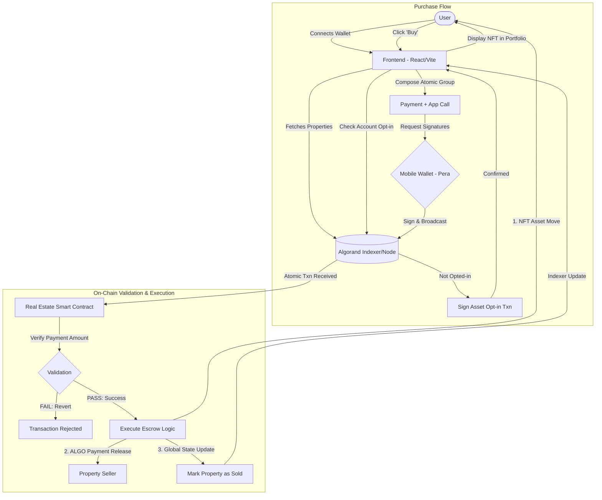

# AlgoMakan: Decentralized Real Estate Marketplace

AlgoMakan is a premium real estate marketplace built on the Algorand blockchain. It enables users to browse, invest in, and own property collectibles (NFTs) with the security and transparency of decentralized technology.

---

## 🏗 Workflow Diagram

The following diagram illustrates the interaction between the user, the frontend application, and the Algorand blockchain ecosystem during a property purchase.



---

## 🌟 Key Features

- **Real Estate NFTs**: Each property is represented as a unique Asset (ASA) on Algorand.
- **Secure Escrow**: Smart contracts manage the exchange of ALGO for NFT assets, ensuring trustless transactions.
- **UI/UX**: A responsive interface designed for real estate presentation.
- **Seamless Wallet Integration**: Supports Algorand wallets like Pera.

---

## 📂 Project Structure

This project is a monorepo managed with **AlgoKit**.

- **[Projects](projects/)**:
  - **[makan-contracts](projects/makan-contracts/)**: TypeScript-based smart contracts (Algorand TypeScript/PuYA TS).
  - **[makan-frontend](projects/makan-frontend/)**: React application with TypeScript and Tailwind CSS.

---

## 🚀 Getting Started

### Prerequisites

- **Node.js** (v22.0 or higher)
- **npm** (v9.0 or higher)
- **AlgoKit CLI** (v2.6.0 or higher)
- **Git**
- **Algorand Testnet Account**: A deployer account with enough Testnet ALGO (get some from the [Algorand Dispenser](https://bank.testnet.algodev.network/)).
- **Docker** (Optional: Only required if you wish to run a local development node/LocalNet).

### Initial Setup

1. **Clone the repository**:
   ```bash
   git clone <repository-url>
   cd makan
   ```

2. **Bootstrap the project**:
   This installs dependencies and sets up virtual environments.
   ```bash
   algokit project bootstrap all
   ```

3. **Build the project**:
   ```bash
   algokit project run build
   ```

4. **Start local network** (Optional):
   Only required if you are developing locally.
   ```bash
   algokit localnet start
   ```

5. **Deploy to Testnet**:
   ```bash
   algokit project deploy testnet
   ```

---

## 🛠 Integrating with Smart Contracts

ApnaMakan uses automatically generated TypeScript clients for interacting with the backend. 

- When you compile smart contracts in `makan-contracts`, artifacts are generated.
- `makan-frontend` automatically picks up these artifacts to create TypeSafe application clients.
- Review [`projects/makan-frontend/package.json`](projects/makan-frontend/package.json) for the `generate:app-clients` command.

---

## 📄 License

This project is licensed under the MIT License.

